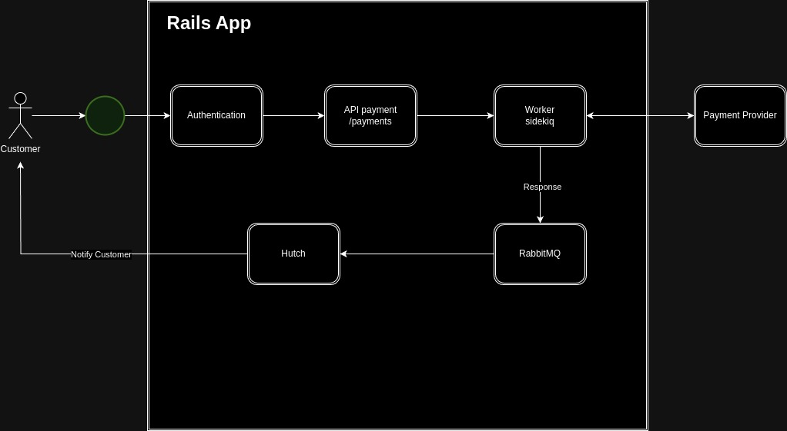
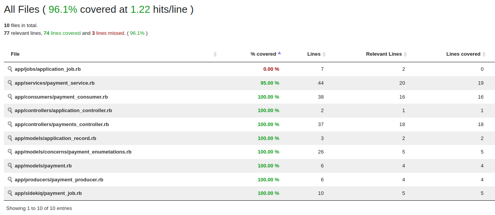

# README

* Payment on Rails
- A Rails app for accepting payments

* Ruby version
- 3.3.0

* System dependencies
- PostgreSQL
- Redis
- RabbitMQ

* Services (queues)
- Sidekiq
- Hutch 

* Deployment 
- Github actions
- AWS

* How to run the app
- `bundle exec rails s -b '0.0.0.0'`

* How to run the sidekiq
- `bundle exec sidekiq config/sidekiq.yml`

* How to run the hutch
- `bundle exec hutch`

* How to run the test suite
- `bundle exec rspec`

## Architecture

## Code coverage
