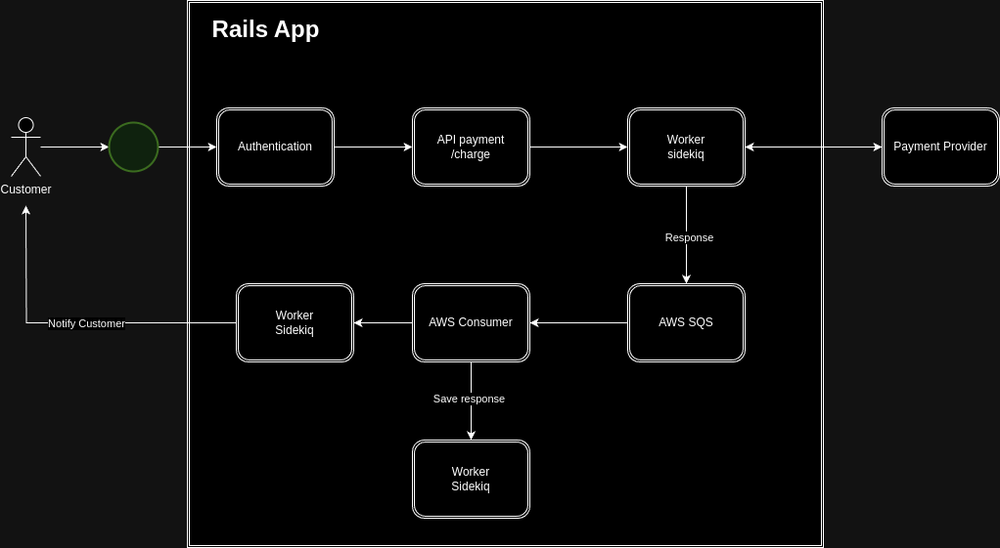

# README

* Payment on Rails
- A Rails app for accepting payments

* Ruby version
- 3.3.0

* System dependencies
- PostgreSQL
- Redis
- AWS SQS

* How to run the test suite
- `bundle exec rspec`

* Services (job queues, cache servers, search engines, etc.)
- AWS SQS
- Sidekiq

* Deployment 
- Github actions
- AWS

## Architecture

